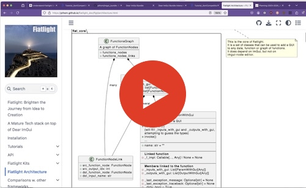

API
===

High level overview video
-------------------------

The video below present a high-level overview of Fiatlight's architecture and how it automatically maps functions and data types to UI components.  

🔗 [Watch Video](https://share.descript.com/view/xkgrDb7Kzzj)  

Architecture
------------

* [Fiatlight Architecture](api_architecture): Overview of the Fiatlight architecture, including the class diagrams and folders structure.

fiat_core
---------

fiat_core is the foundational package of the fiatlight framework. It focuses on wrapping data and functions with GUI elements to facilitate interaction.

Its most important classes are:

* [`FunctionWithGui`](api_function_with_gui): Encapsulates a function, enriching it with a GUI based on inferred input and output types. It handles function invocation and manages internal states like exceptions and execution flags.
* [`AnyDataWithGui`](api_any_data_with_gui): Wraps any type of data with a GUI. This class manages the data value and its associated callbacks, and it provides methods to serialize/deserialize the data to/from JSON.
* [`AnyDataGuiCallbacks`](api_any_data_gui_callbacks): Stores callback functions for AnyDataWithGui, enhancing interactivity by allowing custom widgets and presentations.
* [`FunctionsGraph`](api_functions_graph): Represents a graph of functions, where the output of one function can be linked to the input of another function. It allows the user to create complex workflows by chaining functions together.

