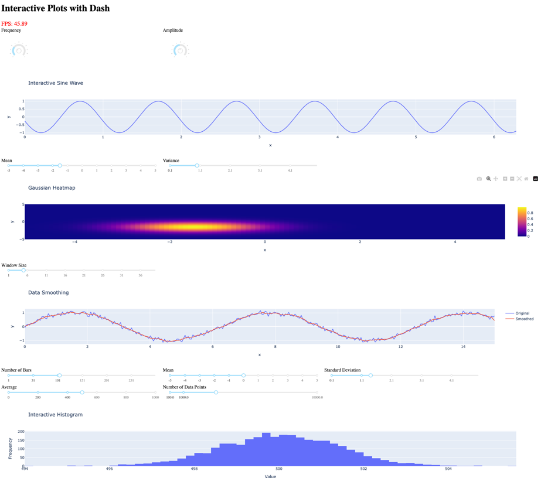

# Comparison with Dash

This page provides a detailed comparison between Fiatlight and Dash, highlighting the strengths and weaknesses of each framework.

## Summary
1. **Example used for the comparison**:
   *Display multiple Matplotlib figures and an animated sine wave*

2. **Performance and Responsiveness**:
   *Dash can update the graph up to 45 FPS on a local server (using Plotly), but is likely to be slower on a remote server. Fiatlight can update the graph up to 35 FPS when using Matplotlib. If using [ImPlot](https://github.com/epezent/implot) instead of Matplotlib, Fiatlight would reach the artificial limit of 120 FPS.*

3. **Customization, Layout and Extensibility**:
   *Compare how each framework allows customization of widgets and extensibility.*

4. **State Management**:
   *Evaluate how user inputs and application states are managed and restored.*

5. **Algorithmic Pipelines**:
   *Examine the support for chaining functions and visualizing their interactions.*

6. **User Experience**:
   *Discuss the overall user experience, including UI manipulation capabilities.*

7. **Ease of Use and Learning Curve**:
   *Assess the ease of learning and using each framework.*

8. **Deployment and Accessibility**:
   *Compare the deployment capabilities and accessibility, including online execution.*

9. **Community and Support**:
   *Look at the available community support and resources.*

10. **Integration with Data Science Tools**:
    *Analyze how well each framework integrates with popular data science libraries and tools.*

## Detailed Comparison

### 1. Example used for the comparison
This comparison is based on the following example, which includes several Matplotlib figures, along with an animated sine wave.

#### Using Fiatlight

See the code of [figure_with_gui_demo.py](../fiat_kits/fiat_matplotlib/figure_with_gui_demo.py).

Here it is in action with Fiatlight. The sine wave is animated at 35 FPS (it could be 120 FPS if using ImPlot instead of MatPlotlib).
```python
from fiatlight.fiat_kits.fiat_matplotlib import figure_with_gui_demo
figure_with_gui_demo.main()
```

#### Using Dash

A similar application was coded for Dash. Here is its [source code](../fiat_kits/fiat_matplotlib/comparison_dash/figure_demo_dash.py).

And below is a screenshot of the Dash app with multiple figures and an animated sine wave.


### 2. Performance and Responsiveness
- **Fiatlight**:
    - When using Matplotlib, Fiatlight runs at 35 FPS. When using ImPlot, it runs at the artificial limit of 120 FPS.
- **Dash**:
    - Dash can update the graph up to 45 FPS on a local server (using Plotly), but is likely to be slower on a remote server, because each timer update requires communication via a web socket.

### 3. Customization, Layout and Extensibility
- **Fiatlight**:
    - Allows deep customization of widgets, including advanced editing types and ranges. Users can define custom widgets and function graphs for extensive flexibility.
    - Supports advanced layout management, including resizing and moving figures. Arranging the functions on the screen is as easy as dragging with the mouse. And since those options are saved, they become part of the final application.
    - The code for the application occupies 135 Python lines.
- **Dash**:
    - Offers a wide range of customizable components including Knobs, but may require more manual coding to achieve highly customized interfaces.
    - The layout is achieved via standard HTML divs. Changing their size or moving them requires some adaptation on the Python side.
    - The code for the application occupies 242 Python lines.

### 4. State Management
- **Fiatlight**:
    - Automatically saves and restores user inputs, widget placements, and settings. Supports saving different configurations and restoring them later.
- **Dash**:
    - State management is manual and typically involves more code to save and restore states across sessions.

### 5. Algorithmic Pipelines
- **Fiatlight**:
    - Supports function graphs, enabling chaining of functions and visualization of their inputs and outputs, simplifying complex workflows.
- **Dash**:
    - Supports callbacks to chain functions but may be less visual and more code-intensive.

### 6. User Experience
- **Fiatlight**:
    - Offers a rich user experience with the ability to resize and move figures, enhancing usability and flexibility.
- **Dash**:
    - Provides a straightforward interface with interactive components but lacks advanced UI manipulation features like resizing and moving figures.

### 7. Ease of Use and Learning Curve
- **Fiatlight**:
    - Powerful and flexible, but it might require some initial learning since it is a novel framework. However, the immediate GUI mode is easy to grasp, making it accessible for new users.
- **Dash**:
    - User-friendly but can become complex with advanced use cases, requiring a good understanding of the Dash framework and callbacks.

### 8. Deployment and Accessibility
- **Fiatlight**:
    - Fiatlight can run inside a Jupyter Notebook, but requires a local environment and lacks web-based deployment capabilities. Efforts with pyodide are underway but still in development.
- **Dash**:
    - Easily deployable on the web, with built-in support for deploying to cloud platforms like Heroku and Azure.

### 9. Community and Support
- **Fiatlight**:
    - May not have as extensive a community or support resources as Dash.
- **Dash**:
    - Large and active community, extensive documentation, and support resources, beneficial for new users and those seeking help or examples.

### 10. Integration with Data Science Tools
- **Fiatlight**:
    - Can integrate with data science tools but may require more setup and configuration. Its use of Dear ImGui allows for high-performance graphics and interactive applications, which can be beneficial for certain data science applications.
- **Dash**:
    - Well-integrated with popular data science libraries and tools, making it a go-to choice for data scientists and analysts.

### Conclusion
Both Fiatlight and Dash have their unique advantages.

- **Fiatlight** excels in high-performance applications, offering extensive customization, advanced interactive features, and sophisticated state management that includes automatic saving and restoring of user inputs and widget placements. This makes it exceptionally well-suited for rapid prototyping, as users can quickly iterate on their designs without losing their configurations. Its support for function graphs simplifies complex workflows, making it a powerful tool for developing creative applications.

- **Dash** is ideal for users who prioritize building interactive dashboards and data visualization applications with ease of deployment. It offers a user-friendly interface that facilitates rapid development and deployment, especially for data-driven applications. Its seamless integration with popular data science libraries and robust web deployment capabilities make it accessible and powerful for building analytical web applications.

The choice between them depends on the specific needs and preferences of the user or project. Fiatlight offers a more feature-rich environment for those needing advanced GUI capabilities and state management, while Dash provides a robust solution for building and deploying data-driven dashboards and applications.
