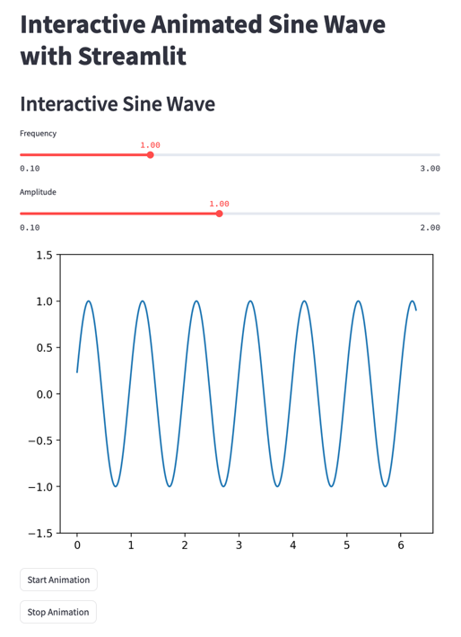

# Comparison with Streamlit

This page provides a detailed comparison between Fiatlight and Streamlit, highlighting the strengths and weaknesses of each framework.

## Summary
1. **Example used for the comparison**:

   *Display multiple Matplotlib figures and an animated sine wave*

2. **Performance and Responsiveness**:

   *Streamlit can refresh figures at about 2 FPS, while Fiatlight can update them at 35 FPS (it could be 120 FPS if using ImPlot instead of MatPlotlib). However, no particular effort was made in optimizing streamlit workflow.*

3. **Customization and Extensibility**:

   *Compare how each framework allows customization of widgets and extensibility.*

4. **State Management**:

   *Evaluate how user inputs and application states are managed and restored.*

5. **Algorithmic pipelines**:

   *Examine the support for chaining functions and visualizing their interactions.*

6. **User Experience**:

   *Discuss the overall user experience, including UI manipulation capabilities.*

7. **Ease of Use and Learning Curve**:

   *Assess the ease of learning and using each framework.*

8. **Deployment and Accessibility**:

   *Compare the deployment capabilities and accessibility, including online execution.*

9. **Community and Support**:

   *Look at the available community support and resources.*

10. **Integration with Data Science Tools**:

    *Analyze how well each framework integrates with popular data science libraries and tools.*

## Detailed Comparison

### 1. Example used for the comparison
This comparison is based on the following example, which includes several MatPlotlib figures, along with an animated sine wave.

#### Using Fiatlight
See the code of [figure_with_gui_demo.py](../fiat_kits/fiat_matplotlib/demo_matplotlib.py).

Here it is in action with Fiatlight. The sine wave is animated at 35 FPS.

```python
from fiatlight.fiat_kits.fiat_matplotlib import demo_matplotlib

figure_with_gui_demo.main()
```

### Using Streamlit
The code for Streamlit was split into two parts: [figures](../fiat_kits/fiat_matplotlib/comparison_streamlit/figure_demo_streamlit.py) and [animated sine wave](../fiat_kits/fiat_matplotlib/comparison_streamlit/anim_wave_streamlit.py).

Here are screenshots of it in action within Streamlit. The sine wave is animated at 2 FPS.



### 2. Performance and Responsiveness
- **Fiatlight**:
    - Updates at 35 frames per second, providing real-time interactivity.
      If using [ImPlot](https://github.com/epezent/implot) instead of Matplotlib, Fiatlight would reach the artificial limit of 120 FPS.
- **Streamlit**:
    - Displays at about 2 frames per second. However, no particular effort was made in optimizing streamlit workflow; and better results may be possible (maybe by switching from Matplotlib to Plotly).

### 3. Customization and Extensibility
- **Fiatlight**:
    - Allows deep customization of widgets, including advanced editing types and ranges. Users can define custom widgets and function graphs for extensive flexibility.
- **Streamlit**:
    - Provides a wide range of built-in widgets and customization options, but may not match Fiatlight’s specialized functionalities.

### 4. State Management
- **Fiatlight**:
    - Automatically saves and restores user inputs, widget placements, and settings. Supports saving different configurations and restoring them later.
- **Streamlit**:
    - Requires manual handling of state management. Users need to implement custom solutions to save and restore states across sessions.

### 5. Algorithmic pipelines
- **Fiatlight**:
    - Supports function graphs, enabling chaining of functions and visualization of their inputs and outputs, simplifying complex workflows.
- **Streamlit**:
    - Does not natively support function graphs. Users need to manually code function linkages, which can be more cumbersome.

### 6. User Experience
- **Fiatlight**:
    - Offers rich user experience with the ability to resize and move figures, enhancing usability and flexibility.
- **Streamlit**:
    - Provides a straightforward interface but lacks advanced UI manipulation features like resizing and moving figures.

### 7. Ease of Use and Learning Curve
- **Fiatlight**:
    - Powerful and flexible but might have a steeper learning curve due to advanced features.
- **Streamlit**:
    - User-friendly and easy to learn, allowing rapid development and prototyping with minimal code.

### 8. Deployment and Accessibility
- **Fiatlight**:
    - Fiatlight can run inside a Jupyter Notebook, but requires a local environment and lacks web-based deployment capabilities. Efforts with pyodide are underway but still in development.
- **Streamlit**:
    - Easily deployable on the web and compatible with platforms like Google Colab, making it accessible from anywhere, which is advantageous for collaboration and sharing.

### 9. Community and Support
- **Fiatlight**:
    - May not have as extensive a community or support resources as Streamlit.
- **Streamlit**:
    - Large and active community, extensive documentation, and support resources, beneficial for new users and those seeking help or examples.

### 10. Integration with Data Science Tools
- **Fiatlight**:
    - Can integrate with data science tools but may require more setup and configuration. Its use of Dear ImGui allows for high-performance graphics and interactive applications, which can be beneficial for certain data science applications.
- **Streamlit**:
    - Well-integrated with popular data science libraries and tools, making it a go-to choice for data scientists and analysts.

### Conclusion
Both Fiatlight and Streamlit have their unique advantages.

- **Fiatlight** excels in high-performance applications, offering extensive customization, advanced interactive features, and sophisticated state management that includes automatic saving and restoring of user inputs and widget placements. This makes it exceptionally well-suited for rapid prototyping, as users can quickly iterate on their designs without losing their configurations. Its support for function graphs simplifies complex workflows, making it a powerful tool for developing intricate applications.

- **Streamlit** is ideal for users who prioritize ease of use and web-based deployment. It offers a user-friendly interface that facilitates rapid development and prototyping, especially for data-driven applications and dashboards. Its seamless integration with popular data science libraries and web deployment capabilities makes it accessible from anywhere, promoting collaboration and sharing.

The choice between them depends on the specific needs and preferences of the user or project. Fiatlight offers a more feature-rich environment for those needing advanced GUI capabilities and state management, while Streamlit provides a simpler, more accessible solution for data visualization and web deployment.
