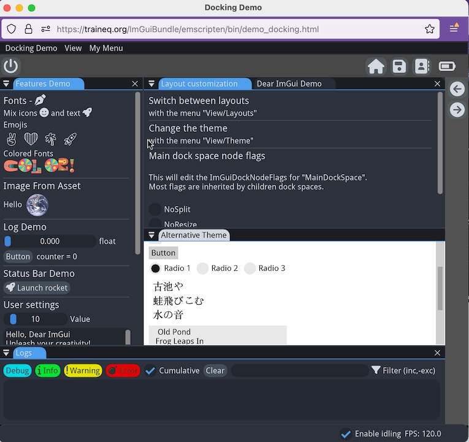

A Mature Tech stack on top of Dear ImGui
========================================

> Fiatlight is built on top of several powerful libraries and tools, including [Dear ImGui](https://github.com/ocornut/imgui), [Hello ImGui](https://pthom.github.io/hello_imgui), and [Dear ImGui Bundle](https://pthom.github.io/imgui_bundle).

Dear ImGui
==========

<a href="https://github.com/ocornut/imgui"></a>

*[Dear ImGui](https://github.com/ocornut/imgui) is a Bloat-free Graphical User interface for C++ with minimal dependencies*

Dear ImGui is a simple and powerful immediate mode GUI library, designed to be easy to integrate and use. It is written in C++, but can be used in many other languages, including Python. It is extremely lightweight and performant, and can be used in a wide range of applications, from games to scientific simulations.

## Documented Python bindings

Thanks to [Dear ImGui Bundle](https://pthom.github.io/imgui_bundle), python bindings for ImGui [are available](https://github.com/pthom/imgui_bundle/blob/main/bindings/imgui_bundle/imgui/), and it can even be used from within a Jupyter notebook.

They reproduce the C++ API in python with high fidelity, and are extensively documented.
What's more they are **autogenerated**, so that they are always very close to the latest greatest version.


## Dear ImGui is an immediate mode C++ GUI library

In an immediate GUI, widgets display and event handling are done at the same time. For example:

* a call to `imgui.button("Click me")` will at the same time display the button and return true if it was clicked.
* a call to ` imgui.input_text("some label", some_string)` will display a text input and return a tuple `(changed, new_string_value)` where `changed` is true if the text was modified.


*Example: the following code will display a button and increment a counter when it is clicked:*
```python
from imgui_bundle import imgui, immapp

counter = 0
name = ""

def gui():
    global counter, name
    imgui.text("Counter = %i" % counter)
    imgui.same_line()

    if imgui.button("increment counter"):
        counter += 1

    changed, name = imgui.input_text("Your name?", name)
    imgui.text("Hello %s!" % name)

# Run the GUI in this notebook (and display a thumbnail afterwards)
immapp.run_nb(gui)
```

## ImGui is its own teacher!

Thanks to [ImGui Manual](https://pthom.github.io/imgui_manual_online/manual/imgui_manual.html), you can explore the numerous ImGui widgets, and see the python code behind each.

[](https://pthom.github.io/imgui_manual_online/manual/imgui_manual.html)

> 1. Open the [manual](https://pthom.github.io/imgui_manual_online/manual/imgui_manual.html)
> 2. Tick the "Python" checkbox
> 3. Explore the widgets on the left panel
> 4. See the corresponding python code on the right panel

## An extensively documented API
The [API for ImGui python bindings](https://github.com/pthom/imgui_bundle/blob/main/bindings/imgui_bundle/imgui/) is extensively documented, and gives you access to all the ImGui functions, along with their python and  C++ signatures.


## Links

- Source: https://github.com/ocornut/imgui
- Documentation:
  - Interactive Manual: https://pthom.github.io/imgui_manual_online/manual/imgui_manual.html
  - Wiki: https://github.com/ocornut/imgui/wiki
- Gallery & Real world apps: https://github.com/ocornut/imgui/issues/7503
- Python Bindings, with Dear ImGui Bundle (autogenerated): https://github.com/pthom/imgui_bundle/tree/main/bindings/imgui_bundle/imgui

-------------------------------------------------------------------------------

Hello ImGui
===========
<a href="https://pthom.github.io/hello_imgui"></a>

*[Hello ImGui](https://pthom.github.io/hello_imgui) is a library designed to make multiplatform app development as simple as writing a “Hello World” program, built on top of Dear ImGui.*

Thanks to [Dear ImGui Bundle](https://pthom.github.io/imgui_bundle), python bindings for Hello ImGui [are available](https://github.com/pthom/imgui_bundle/blob/main/bindings/imgui_bundle/hello_imgui.pyi).

<a href="https://traineq.org/ImGuiBundle/emscripten/bin/demo_docking.html"></a>

*(An advanced [tutorial](https://github.com/pthom/imgui_bundle/blob/main/bindings/imgui_bundle/demos_python/demos_immapp/demo_docking.py) with Hello ImGui. Click the image to run it)*


## Extensive tutorials and demos
The demo for [Dear ImGui Bundle](https://traineq.org/ImGuiBundle/emscripten/bin/demo_imgui_bundle.html) provides great tutorials for the usage of Hello ImGui in python:

[](https://traineq.org/ImGuiBundle/emscripten/bin/demo_imgui_bundle.html)
> 1. Open the [demo](https://traineq.org/ImGuiBundle/emscripten/bin/demo_imgui_bundle.html)
> 2. Click on the "Immediate Apps" tab
> 3. Explore the various demos, run them, and see the python code behind each

## An extensively documented API
The [API for the python bindings](https://github.com/pthom/imgui_bundle/blob/main/bindings/imgui_bundle/hello_imgui.pyi) is extensively documented, and gives you access to all the classes and functions, along with their python and  C++ signatures.

## Links

- Source: https://github.com/pthom/hello_imgui
- Documentation: https://pthom.github.io/hello_imgui
- Demos & Real world apps: https://pthom.github.io/hello_imgui/book/intro.html#demos-real-world-apps
- Python Bindings, with Dear ImGui Bundle (autogenerated): https://github.com/pthom/imgui_bundle/blob/main/bindings/imgui_bundle/hello_imgui.pyi

-------------------------------------------------------------------------------

Dear ImGui Bundle
=================

<a href="https://pthom.github.io/imgui_bundle"></a>

*[Dear ImGui Bundle](https://pthom.github.io/imgui_bundle): easily create ImGui applications in Python and C++. Batteries included!*

Dear ImGui Bundle is an extensive bundle for Dear ImGui, featuring [many powerful libraries](https://pthom.github.io/imgui_bundle/introduction.html) from its ecosystem. It can be used in C++ and Python, across Windows, macOS, Linux, iOS, Android, as well as in Web apps. It is ideal for application developers, and researchers eager to dive into GUI development with ease and efficiency.

### Extensive documentation and tutorials
The [Dear ImGui Bundle documentation](https://pthom.github.io/imgui_bundle) provides a comprehensive guide to the various libraries and tools available in the bundle.

The [online interactive demo](https://traineq.org/ImGuiBundle/emscripten/bin/demo_imgui_bundle.html) showcases the capabilities of the bundle, and provides a hands-on experience with the tools and libraries it offers and many tutorials (the code for all demos can easily be accessed from within the interactive demo).

## An ecosystem of powerful libraries

All the [numerous libraries](https://pthom.github.io/imgui_bundle/introduction.html) provided by the bundle are extensively documented, and can be used in both C++ and Python. The [bindings for all of these libraries](https://github.com/pthom/imgui_bundle/tree/main/bindings/imgui_bundle) are also extensively documented.

What's more, the bindings are generated automatically by a powerful [bindings generator](https://pthom.github.io/litgen), so that they are always up-to-date.


## Links

- Source: https://github.com/pthom/imgui_bundle
- Documentation: https://pthom.github.io/imgui_bundle
- Included Libraries: https://pthom.github.io/imgui_bundle/introduction.html
- Interactive Demo & Manual: https://traineq.org/ImGuiBundle/emscripten/bin/demo_imgui_bundle.html
- Gallery: https://github.com/pthom/imgui_bundle/discussions/107
- Autogenerated and documented Python Bindings, for all the included libraries: https://github.com/pthom/imgui_bundle/tree/main/bindings/imgui_bundle


-------------------------------------------------------------------------------

Python Bindings: from C++ to Python
===================================

The python bindings for all the libraries are autogenerated from the C++ API, and are extensively documented.

## How to use a C++ function in Python

There are two rules of thumbs that were applied when translating the APIs from C++ to Python:

- The names of functions and class members are transformed from CamelCase (C++) to snake_case (Python)
- When a C++ function modifies an argument passed by pointer and returns a bool, the equivalent python function will return a tuple `(changed, new_value)`, where `changed` is a boolean indicating whether the value was modified.

For example, the following C++ function from ImGui,

    IMGUI_API bool          SliderFloat(const char* label, float* v, float v_min, float v_max, const char* format = "%.3f", ImGuiSliderFlags flags = 0);

is translated to the following python function:

    def slider_float(
        label: str, v: float, v_min: float, v_max: float, format: str = "%.3", flags: SliderFlags = 0
    ) -> Tuple[bool, float]:
        pass


**Example with Dear ImGui:**

[This part](https://github.com/ocornut/imgui/blob/b9084949bd70dcc5ec5f3f417e66db613746f1c7/imgui.h#L587-L606) of the ImGui C++ API is equivalent to [this part](https://github.com/pthom/imgui_bundle/blob/cfa5d63540aa04c84ee43565e744d46795966aac/bindings/imgui_bundle/imgui/__init__.pyi#L1567-L1596) of the Python API.

**Example with Hello ImGui:**

[This part](https://github.com/pthom/hello_imgui/blob/571e7287d3e1d2dd08d462a30effbc457e7f233e/src/hello_imgui/runner_params.h#L144-L270) of the Hello ImGui C++ API is equivalent to [this part](https://github.com/pthom/imgui_bundle/blob/cfa5d63540aa04c84ee43565e744d46795966aac/bindings/imgui_bundle/hello_imgui.pyi#L2676-L2835) of the Python API.

**More details:**

For more detail refer to the [C++ / Python porting advices](https://pthom.github.io/imgui_bundle/porting.html) section of the Dear ImGui Bundle documentation.


