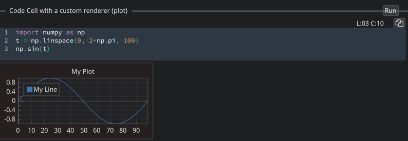

#  Fiatlight: Brighten the Journey from Idea to Creation


Fiatlight is a user-friendly tool that helps you transform your ideas into fully functional applications, using minimal code, or a drag-and-drop interface. The delay between an idea and a full application may be reduced to a few minutes.


> *For technical readers:*
>
> *Fiatlight is a versatile Python framework that enables rapid development and visualization of applications by chaining functions into interactive graphs. It features automatic GUI generation for diverse data types, including primitive type, images, audio (...), and provides powerful debugging tools. It generates full applications that can save their state and presentation options.*

_The name "Fiatlight" is inspired by "Fiat Lux", i.e. "Let there be light"._

# Key Features and examples

## Create an GUI for any function

Simply call `fl.run` with a function or a list of functions, and Fiatlight will automatically generate a GUI for them.

```python
# Part 1: Standard Python code (no user interface)
# ------------------------------------------------
import numpy as np
from matplotlib.figure import Figure
import matplotlib.pyplot as plt


def lissajous_curve(freq1: float = 5.0, freq2: float = 4.0, delta: float = np.pi / 2, nb_periods: float = 1) -> Figure:
    """Creates a Lissajous curve, and returns a Matplotlib figure."""
    t = np.linspace(0, 2 * np.pi * nb_periods, 10_000)
    x = np.sin(freq1 * t + delta)
    y = np.sin(freq2 * t)
    fig, ax = plt.subplots()
    ax.plot(x, y)
    return fig


# Part 2: Add a GUI to the code in a few seconds
# -----------------------------------------------
import fiatlight as fl

# Options for widgets
fl.add_fiat_attributes(
    lissajous_curve,
    freq1__range=(0, 10), freq2__range=(0, 10), delta__range=(-np.pi, np.pi),
    nb_periods__range=(0.1, 10), nb_periods__edit_type="knob",
)
# Run the function interactively
fl.run(lissajous_curve, app_name="Interactive Lissajou Curve")
```

*See the application in action in the video below*

<video src="_static/videos/lissajou.mp4" controls="controls" width="30%" height="auto"></video>

## From Idea to App in 3 minutes

Create a full application in just 4 lines of Python by chaining pure Python functions into an interactive graph. This graph visually displays each function’s inputs and outputs, allowing for manual input adjustments.


*Example: The application below is a meme generator. It is a simple composition of an AI image generator, and a function that adds text onto an image*

```python
import fiatlight as fl
from fiatlight.fiat_kits.fiat_ai import invoke_sdxl_turbo
from fiatlight.fiat_kits.fiat_image.add_meme_text import add_meme_text

# Run the composition to create a simple app
fl.run([invoke_sdxl_turbo, add_meme_text], app_name="Old school meme generator")
```

This can be used as a full application:
  * All inputs are saved: prompt, and meme text, font, color, position of the text
  * All preferences are saved: window size, position, and layout of the nodes
  * The user can save and load different state of the application (i.e. different memes)


> *For technical readers: [`invoke_sdxl_turbo`](https://github.com/pthom/fiatlight/blob/refact_io/src/python/fiatlight/fiat_kits/fiat_ai/invoke_sdxl_turbo.py) provides a simple wrapper to SDXL, and [`add_meme_text`](https://github.com/pthom/fiatlight/tree/refact_io/src/python/fiatlight/demos/images/old_school_meme.py) is a Python function that adds colored text onto an image.*


## Domain-specific Kits:

`fiatlight.fiats_kits` is intended to provide a set of pre-built functions and widgets for various domains, such as:

- **Image analysis**: Sophisticated image analysis and manipulation widgets. See [fiat_image](fiat_image.ipynb).

- **Data Visualization**: Display interactive data plots and charts for real-time data analysis, using MatPlotlib or ImPlot. See [fiat_matplotlib](fiat_matplotlib.ipynb), and [fiat_implot](fiat_implot.ipynb) (for ImPlot)

- **Data Exploration**: Provide widgets for exploring dataframes. See [fiat_dataframe](fiat_dataframe.ipynb).

- **AI**: (Draft) Provide a widget for Prompt entry, and an interface to Stable Diffusion. See [fiat_ai](https://github.com/pthom/fiatlight/tree/refact_io/src/python/fiatlight/fiat_kits/fiat_ai).


### Image analysis

*The example below shows an image which undergoes a pipeline for a dilated edge extraction. The image viewer can pan & zoom the images in sync, and display the pixel values*

```python
import fiatlight as fl
from fiatlight.fiat_kits.fiat_image import image_from_file
from fiatlight.demos.images.opencv_wrappers import canny, dilate

fl.run([image_from_file, canny, dilate], app_name="demo_computer_vision")
```
>*For technical readers: [`image_from_file`](https://github.com/pthom/fiatlight/blob/refact_io/src/python/fiatlight/fiat_kits/fiat_image/image_to_from_file_gui.py) is a function that reads an image from a file, [`canny`](https://github.com/pthom/fiatlight/blob/refact_io/src/python/fiatlight/demos/images/opencv_wrappers.py) applies the Canny edge detection algorithm, and [`dilate`](https://github.com/pthom/fiatlight/blob/refact_io/src/python/fiatlight/demos/images/opencv_wrappers.py) dilates the edges.*

### Data visualization with Matplotlib and ImPlot

*In the example below, we display figures using [ImPlot](https://github.com/epezent/implot) (left) and [Matplotlib](https://matplotlib.org/) (right). Each figure provides user-settable parameters (in a given range, with customizable widgets). The sine wave function is updated in real time.*

```python
from fiatlight.demos.plots import demo_mix_implot_matplotib

demo_mix_implot_matplotib.main()
```

> *For technical readers:* 
> * when a function returns a `matplotlib.figure.Figure`, its output will be displayed as a plot. See demo_matplotlib.py [source code](https://github.com/pthom/fiatlight/blob/refact_io/src/python/fiatlight/fiat_kits/fiat_matplotlib/demo_matplotlib.py).*
> * when a function returns a `fiat_implot.FloatMatrix_Dim1` or `fiat_implot.FloatMatrix_Dim2` (which are aliases for np.ndarray), its output will be displayed as a plot, using [ImPlot](https://github.com/epezent/implot). See demo_implot [source code](https://github.com/pthom/fiatlight/blob/refact_io/src/python/fiatlight/fiat_kits/fiat_implot/demo_implot.py). 
> * [ImPlot](https://github.com/epezent/implot) is a plotting library for Dear ImGui. It is often faster than Matplotlib, and can be used in real-time applications. For a complete demo of ImPlot, click here: [ImPlot complete demo](https://traineq.org/implot_demo/src/implot_demo.html)*

### Data Exploration
*In the example below, we display a data frame from the famous titanic example with filtering.*

```python
from fiatlight.fiat_kits.fiat_dataframe import dataframe_with_gui_demo_titanic
dataframe_with_gui_demo_titanic.main()
```

### AI - Image generation

*Example: the application below generates images using a stable diffusion model, and enables to add effects to it (color transformation, add colored edges).*

```python
import fiatlight as fl
from fiatlight.fiat_kits.fiat_ai import invoke_sdxl_turbo
from fiatlight.fiat_kits.fiat_image import lut_channels_in_colorspace
from fiatlight.demos.images.toon_edges import add_toon_edges

fl.run([invoke_sdxl_turbo, lut_channels_in_colorspace, add_toon_edges], app_name="SDXL Edges")
```

>*For technical readers: `invoke_sdxl_turbo` uses HuggingFace's diffuser library to invoke stable diffusion. See its [source code](https://github.com/pthom/fiatlight/blob/refact_io/src/python/fiatlight/fiat_kits/fiat_ai/invoke_sdxl_turbo.py)*

### Audio processing (experimental)

*Example: the application below is a demo where you can sing into the microphone and see information about the note you're singing + advanced graphs using librosa.*

```python
from fiatlight.fiat_kits.experimental.fiat_audio_simple.demos import demo_audio_processing
demo_audio_processing.main()
```

>*For technical readers: See demo_audio_processing [source code](https://github.com/pthom/fiatlight/blob/refact_io/src/python/fiatlight/fiat_kits/experimental/fiat_audio_simple/demos/demo_audio_processing.py)*

## Visualize, Understand, Innovate


### Visualize the Pipeline flow

*Example: the application below looks for the most frequent words in a given text file (here with the text from "Hamlet"), by applying a pipeline of transformations. It is possible to inspect the input and outputs of each function.*

```python
from fiatlight.demos.string import demo_word_count
demo_word_count.main()
```

> *For technical readers: demo_word_count will simply chain the following string functions:
>     `text_from_file, str_lower, split_words, filter_out_short_words,
>     sort_words, run_length_encode, sort_word_with_counts`.
> See its [source](https://github.com/pthom/fiatlight/blob/refact_io/src/python/fiatlight/demos/string/demo_word_count.py)*

### Examine and understand function internals

fiatlight provides you with powerful tools to visually debug the intermediate states of your function.

*Example: the function add_toon_edges below is a complex function that adds a toon effect to an image. We can visualize the intermediate internal variables of the function (edges, dilated edges), even if they are not returned by the function.*

```python
import fiatlight as fl
from fiatlight.fiat_kits.fiat_image import ImageU8_GRAY, ImageU8_3, image_source
from fiatlight.demos.images.toon_edges import add_toon_edges

fl.run([image_source, add_toon_edges], app_name="Toon Edges")
```

> *For technical readers: the function `add_toon_edges` has an attribute `fiat_tuning` that contains the internal variables that will be displayed. See [demos/images/toon_edges.py](https://github.com/pthom/fiatlight/blob/refact_io/src/python/fiatlight/demos/images/toon_edges.py).*


### Replay and debug function errors

*Example: the following application raises an error. However, this error can be replayed, with **the exact same inputs** to facilitate the debugging*

```python
import fiatlight as fl
import math

def float_source(x: float) -> float:
    """A source where the user can specify an input value."""
    return x
def sin(x: float) -> float:
    return math.sin(x)
def log(x: float) -> float:
    return math.log(x)

fl.run([float_source, sin, log], app_name="Replay error")
```

> *For technical readers: the function `log` will raise an error when x is negative. Once you click on the "Debug this exception" button, you will be able to debug it:*


## Full-fledged Applications

Besides being extremely powerful to generate function graphs, Fiatlight's powerful GUI capabilities can also help you generate sophisticated classic applications.

#### Sophisticated widgets and data validation
The application below, demonstrate how you can use Fiatlight GUI capabilities to edit complex data. The GUI definition was created automatically, from the data definition (including the validation rules, in yellow).

```python
from fiatlight.demos.full_fledged_app import demo_basemodel_app
# demo_basemodel_app.main()
```


> *For technical readers: See the [source code](https://github.com/pthom/fiatlight/blob/refact_io/src/python/fiatlight/demos/full_fledged_app/demo_basemodel_app.py) for demo_basemodel_app.py*. The GUI was created automatically, from a nested Pydantic model, with custom validator.

### Applications with advanced GUI

The example below shows an application which: 
- reuses the sophisticated GUI provided by Fiatlight in a standard application
- automatically, Save and reloads its state, and GUI presentation options 
- provides dockable windows, and a top toolbar

```
from fiatlight.demos.full_fledged_app import demo_image_processors_app
# demo_image_processors_app.main()
```


> * For technical readers: See the [source code](https://github.com/pthom/fiatlight/blob/refact_io/src/python/fiatlight/demos/full_fledged_app/demo_image_processors_app.py) for demo_image_processors_app.py*.


## Custom Graph Creation

Create custom graphs with a drag-and-drop interface, similar to Scratch, enabling a visual approach to building workflows.

*Example: in the image below, its is possible to add and link function nodes:*

```python
from fiatlight.demos.custom_graph import demo_custom_graph
# demo_custom_graph.main()
```


> *For technical readers: See the [source code](https://github.com/pthom/fiatlight/blob/refact_io/src/python/fiatlight/demos/custom_graph/demo_custom_graph.py) for custom_graph.py*


## Custom Widgets

Define custom ranges for data types, create custom widgets, and leverage special function attributes like async, live, and ranges for enhanced functionality and performance.

*Example: display and play a sound wave with a custom widget*

```python
import fiatlight as fl
from fiatlight.fiat_kits.experimental.fiat_audio_simple import sound_wave_from_file
fl.run(sound_wave_from_file, app_name="Sound Wave Player")
```

> *For technical readers: `sound_wave_from_file` is a function that returns a sound wave from a file, and the widget is a custom widget that displays the sound wave and allows you to play it. See its [source code](https://github.com/pthom/fiatlight/blob/refact_io/src/python/fiatlight/fiat_kits/experimental/fiat_audio_simple/sound_wave_player_gui.py)*


## A sneak peek at the future: desktop Notebooks

The advanced GUI creation capabilities of Fiatlight might make it possible to consider providing an alternative renderer for Jupyter notebooks, using Fiatlight highly interactive widgets. They would run outside the browser, and may provide a more desktop-like experience for some notebooks.




---------------------------------------------------------------------------------------------------

# Use Cases

Fiatlight is well-adapted for:

- **App Prototyping**: Quickly prototype and develop robust applications.
- **Fine-Tuning and Debugging**: Leverage Fiatlight as a powerful tool for fine-tuning your applications and shining light on all the intermediate states of your algorithms.
- **Education**: Teach programming and data analysis with interactive tools.
- **Data Exploration**: Engage in interactive exploration and visualization of complex datasets.
- **AI Development**: Build and visualize sophisticated AI models and algorithms.
- **App Development**: Since it is based on Dear ImGui, prototypes developed with fiatlight can serve as a basis for full-fledged applications. Those application may then also be translated to C++ with little effort, since the C++ and Python API for ImGui and Hello ImGui are very similar.

# Comparable Frameworks

Fiatlight combines the strengths of several other tools and frameworks, while trying to provide a more integrated and flexible solution, making it suitable for both beginners and advanced users.

- **[Scratch](https://scratch.mit.edu/)**: For visual graph creation.
- **[Jupyter](https://jupyter.org/)**: For interactive data exploration.
- **[Unity Blueprints](https://docs.unrealengine.com/4.27/en-US/ProgrammingAndScripting/Blueprints/)**: For visual scripting and custom widgets.
- **[Python Streamlit](https://streamlit.io/)** & **[Dash](https://plotly.com/dash/)**: For easy app creation with integrated GUI elements.
- **[Ryven](https://ryven.org/)**: For advanced graph creation.
- **[Comfy UI](https://github.com/comfyanonymous/ComfyUI)**: For AI workflow integration.
- **[LEGO Mindstorms](https://www.lego.com/en-us/themes/mindstorms/about)**: For educational and creative applications.


> Compared to the aforementioned software frameworks, Fiatlight distinguishes itself by:
>
> **Pros**
> - its advanced introspection capabilities, which enable the automatic creation of a graphical interface
> - its ability to visualize the intermediate states of a function
> - its ability to replay errors
> - its ability to automatically save and restore the state of an application, and to save and reload several states per application
> - its speed and efficiency, thanks to the fact that the rendering is done in C++ with ImGui and OpenGL
> - its use of the immediate mode GUI paradigm, which makes it easy to create very adaptive and responsive GUIs
> - its ability to prepare the path to a full-fledged application, since any custom widgets and callbacks developed within Fiatlight can be reused in an application based on Dear ImGui (and/or Dear ImGui Bundle). Transitioning to C++ is also within reach, since the C++ and Python API for ImGui and Hello ImGui are very similar.
>
> **Cons**
> * Fiatlight does work on Jupyter notebooks (this document is actually a Jupyter notebook). However, it requires a local computer (and will not work on Google Colab, for example). Solutions for this are being explored.

Note: detailed comparisons with scratch, ipywidgets, and streamlit can be found in the [comparisons](comparisons) document.
