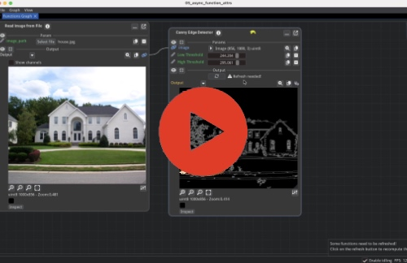
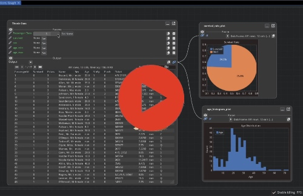

# Video Tutorials

```{tip}
The sources for these tutorials are available in [fiatlight/src/python/fiatlight/demos/tutorials](https://github.com/pthom/fiatlight/tree/main/src/python/fiatlight/demos/tutorials).
```


## First Steps Tutorial

**Creating GUIs from Functions with Minimal Code**

Learn the core concepts of Fiatlight by transforming Python functions into interactive applications. This tutorial demonstrates the fundamental workflow and customization options available.

<table>
<tr>
<td style="vertical-align: center; padding-right: 20px; padding-bottom: 20px; width: 50%">

<a href="https://share.descript.com/view/gQ9ANLrtwQv" target="_blank">

</a>

</td>
<td style="vertical-align: center;">

**Key Topics:**
* Generate GUIs for any Python function
* Compose functions
* Customize widget behavior using fiat_attributes
* Handle long-running computations
* Automatic state persistence
</td>
</tr>
</table>

---

## Intermediate Tutorial

**Exception Handling and Advanced GUI Techniques**

Learn about error handling patterns, parameter validation, and custom GUI components.

<table>
<tr>
<td style="vertical-align: center; padding-right: 20px; padding-bottom: 20px; width: 50%">

<a href="https://share.descript.com/view/gby3nPdZEEE" target="_blank">

</a>

</td>
<td style="vertical-align: center;">

**Key Topics:**
* Built-in exception handling with post-mortem debugging capabilities
* Parameter validation using custom validators and runtime checks
* Custom GUI component creation with Dear ImGui integration
* Visual debugging through fiat_tuning to inspect function internals
* Complex function graphs with multiple data flows and GUI nodes
</td>
</tr>
</table>

---

## GUI for Pydantic Models and Dataclasses

**Automatic Form Generation from Data Models**

Generate validated forms and configuration interfaces directly from dataclasses and Pydantic models. Covers serialization, validation, and customization patterns.

<table>
<tr>
<td style="vertical-align: center; padding-right: 20px; padding-bottom: 20px; width: 50%">

<a href="https://share.descript.com/view/CxaFQ5T6iq7" target="_blank">

</a>

</td>
<td style="vertical-align: center;">

**Key Features:**
* Automatic GUI generation from existing data model definitions
* Real-time validation with user feedback for invalid inputs
* Customization through fiat_attributes for widget types and constraints
* Built-in serialization and state persistence for Pydantic models
* Structured form layouts with logical field grouping
</td>
</tr>
</table>

---


## Advanced Tutorial

**Building a Sorting Algorithm Visualizer**

This tutorial walks through the creation of an interactive sorting algorithm visualizer using Fiatlight, in order to explain advanced features.

<table>
<tr>
<td style="vertical-align: center; padding-right: 20px; padding-bottom: 20px; width: 50%">

<a href="https://share.descript.com/view/oBub1WN28bX" target="_blank">

</a>

</td>
<td style="vertical-align: center;">

**Key Topics:**  
* Asynchronous function execution with real-time GUI updates
* Custom data visualization using ImPlot for performance charts
* Advanced type registration and GUI customization
* Function composition and workflow management patterns
* Standalone application development and deployment
* Performance monitoring and comparative analysis tools

</td>
</tr>
</table>

---


## Fiatlight Architecture  

**Understanding the Framework's Core Components**

A technical overview of Fiatlight's architecture and extension points. Useful for developers who want to understand the framework's internals or extend its capabilities.

<table>
<tr>
<td style="vertical-align: center; padding-right: 20px; padding-bottom: 20px; width: 50%">

<a href="https://share.descript.com/view/xkgrDb7Kzzj" target="_blank">

</a>


</td>
<td style="vertical-align: center;">

**Key Topics:**  
- Core components: `AnyDataWithGui`, `FunctionWithGui`, `FunctionGraph`  
- GUI registry system and type-to-widget mapping mechanisms
- Customization callbacks and data presentation patterns
- Extension points for supporting additional data types

</td>
</tr>
</table>

---

## Full Demo of Fiatlight  

**A comprehensive Feature Overview:**  

This video showcases how Fiatlight can rapidly generate UIs for various across different application domains, from AI integration to data analysis and multimedia processing. It is a demo, rather than a tutorial.

<table>
<tr>
<td style="vertical-align: center; padding-right: 20px; padding-bottom: 20px; width: 50%">

<a href="https://share.descript.com/view/tbvYBh3rpRF" target="_blank">

</a>

</td>
<td style="vertical-align: center;">

**Highlights:**  
- AI-powered meme generator in just 4 lines of code, using Stable Diffusion
- Real-time sorting algorithm visualization: parallel execution and performance comparison
- Tailored kits for image processing, data frames, and audio analysis  
- Fine-tuning and debugging with function state introspection  

</td>
</tr>
</table>


