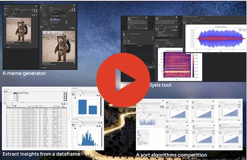
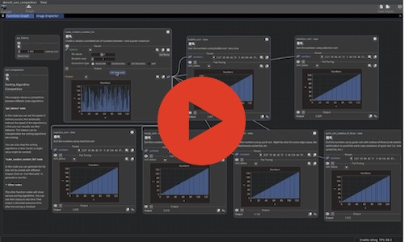
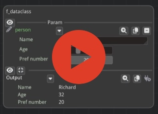

# Video Tutorials

## Full Demo of Fiatlight  
🔗 [Watch Video](https://share.descript.com/view/tbvYBh3rpRF)

**Overview:**  
This video provides a complete walkthrough of Fiatlight, showcasing how it can rapidly generate UIs for various applications. It is a demo, rather than a tutorial. 

**Highlights:**  
- AI-powered meme generator in just 4 lines of code  
- Real-time sorting algorithm visualization  
- Tailored kits for image processing, data visualization, and audio analysis  
- Fine-tuning and debugging with function state introspection  

---

## Advanced Tutorial: Sort Algorithm Visualizer  
🔗 [Watch Video](https://share.descript.com/view/oBub1WN28bX)  

**Overview:**  
This more advanced tutorial walks through the creation of an interactive sorting algorithm visualizer using Fiatlight.  

**Key Topics:**  
- Asynchronous execution for smooth UI updates  
- Using Fiatlight’s function graph to build complex workflows  
- Customizing the UI with additional widgets
- Real-time visualization of sorting algorithms  

---

## Fiatlight Architecture  
🔗 [Watch Video](https://share.descript.com/view/xkgrDb7Kzzj)  

**Overview:**  
A high-level overview of Fiatlight's internal structure and how it automatically maps functions and data types to UI components.  

**Key Topics:**  
- Core components: `AnyDataWithGui`, `FunctionWithGui`, `FunctionGraph`  
- How Fiatlight registers data types to generate interactive UIs  
- Customization callbacks to fine-tune how data is presented  

---

## GUI for Pydantic Models  
🔗 [Watch Video](https://share.descript.com/view/CxaFQ5T6iq7)  

**Overview:**  
Learn how Fiatlight can instantly generate GUIs from Python dataclasses and Pydantic models.  

**Key Features:**  
- Customizing widgets with `fiat_attributes`  
- Automatic validation for user inputs  
- Displaying structured data with interactive components  
