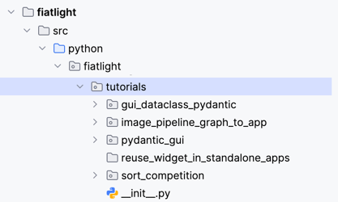

# Video Tutorials

# Tutorials list

## Advanced Tutorial

This tutorial walks through the creation of an interactive sorting algorithm visualizer using Fiatlight, in order to explain more advanced features.

<table>
<tr>
<td style="vertical-align: center; padding-right: 20px; padding-bottom: 20px; width: 50%">

</td>
<td style="vertical-align: center;">

**Key Topics:**  
* Create GUIs for Pydantic models and functions
* Customize outputs with ImPlot charts
* Use Fiatlight’s function graph to build complex workflows  
* Register custom GUIs for types
* Run functions asynchronously with real-time updates
* Build function graphs with GUI and documentation nodes
* Use Fiatlight GUIs inside a standalone app

</td>
</tr>
</table>

---

## GUI for Pydantic Models  

Learn how Fiatlight can instantly generate GUIs from Python dataclasses and Pydantic models.  

<table>
<tr>
<td style="vertical-align: center; padding-right: 20px; padding-bottom: 20px; width: 50%">

</td>
<td style="vertical-align: center;">

**Key Features:**  
- Customizing widgets with `fiat_attributes`  
- Automatic validation for user inputs  
- Displaying structured data with interactive components

</td>
</tr>
</table>

---

## Fiatlight Architecture  

A high-level overview of Fiatlight's internal structure and how it automatically maps functions and data types to UI components.  

<table>
<tr>
<td style="vertical-align: center; padding-right: 20px; padding-bottom: 20px; width: 50%">

</td>
<td style="vertical-align: center;">

**Key Topics:**  
- Core components: `AnyDataWithGui`, `FunctionWithGui`, `FunctionGraph`  
- How Fiatlight registers data types to generate interactive UIs  
- Customization callbacks to fine-tune how data is presented

</td>
</tr>
</table>

---

## Full Demo of Fiatlight  

**Overview:**  
This video provides a complete walkthrough of Fiatlight, showcasing how it can rapidly generate UIs for various applications. It is a demo, rather than a tutorial. 

<table>
<tr>
<td style="vertical-align: center; padding-right: 20px; padding-bottom: 20px; width: 50%">

</td>
<td style="vertical-align: center;">

**Highlights:**  
- AI-powered meme generator in just 4 lines of code  
- Real-time sorting algorithm visualization  
- Tailored kits for image processing, data visualization, and audio analysis  
- Fine-tuning and debugging with function state introspection  

</td>
</tr>
</table>

# Sources for these videos

The sources for these tutorials are available in [src/python/fiatlight/demos/tutorials](https://github.com/pthom/fiatlight/tree/main/src/python/fiatlight/demos/tutorials).

